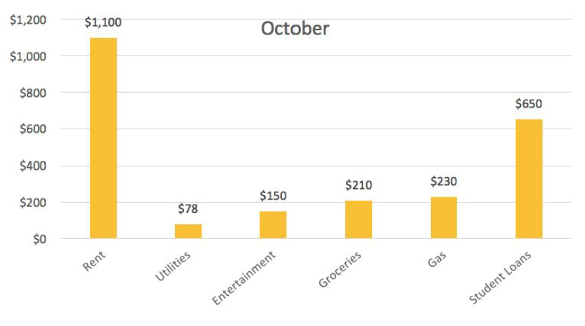
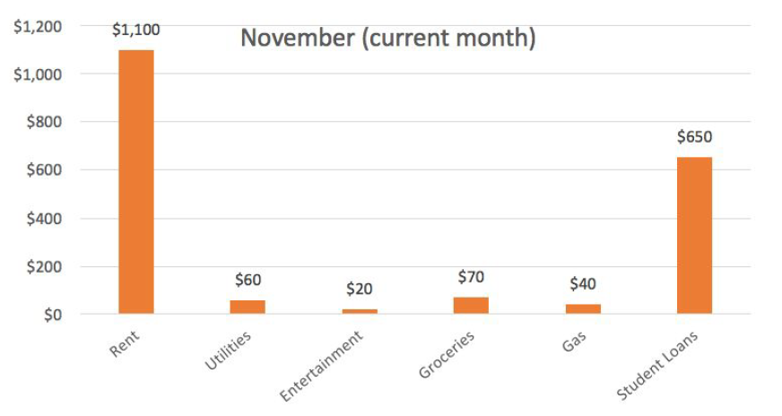
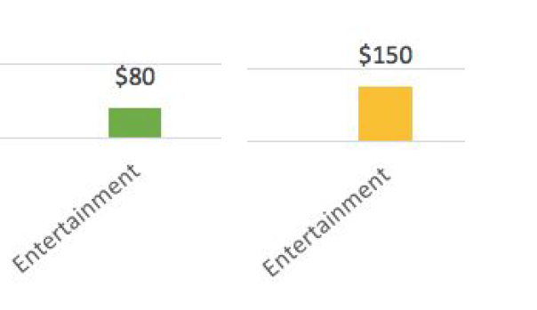
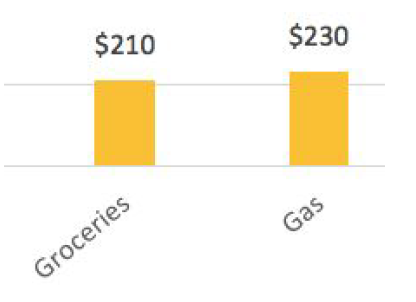
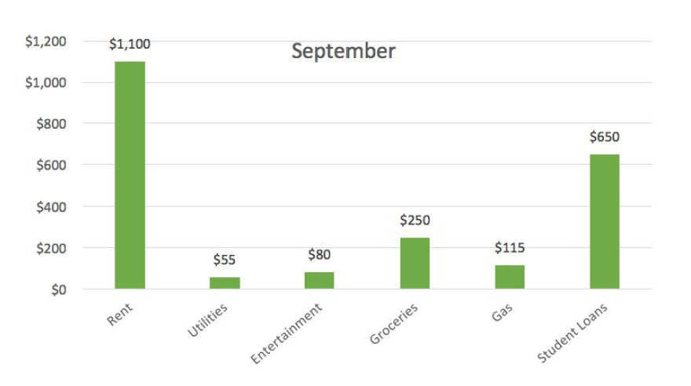
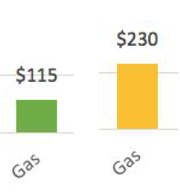
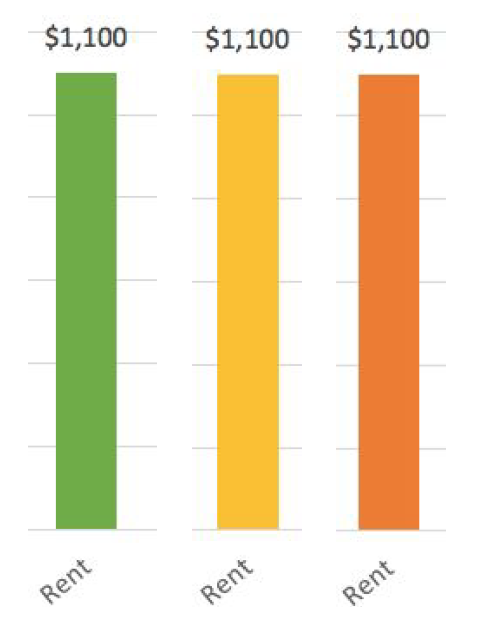
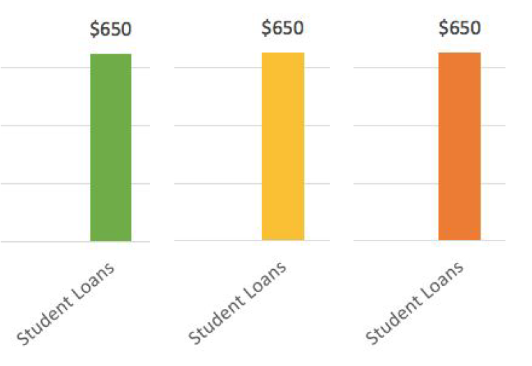
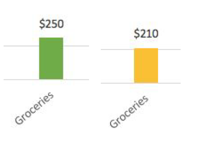

# A Practical Introduction to Data Analysis for Absolute Beginners

## Module 1 - Lab 2: Data Fluency

## Learning Objectives

* Identify whether a data story matches a graph.

## Data Set

There is no data set to download for this lab.

## Overview

Imagine you’re a financial analyst and you’re looking at banking data for one of your clients, Carla.
Your bank has created charts showing Carla’s monthly expenditures for three months in the autumn.
In this lab, you’ll flex your data fluency muscles by identifying whether a series of statements (or “data stories”) match the data visualizations/charts.

### Exercise 1: True or False

Here are three bar graphs showing Carla’s monthly spending for three months, broken down by category.
For the purposes of this lab, let’s say **the current month is November, and the month is less than halfway over**.

In this exercise, we’ll look at 10 different statements and determine whether each is true or false. Try to answer each question on your own before looking at the step-by-step explanations.
Decide whether each statement is true , false , or if we don’t have enough information.

1. Carla’s spending on entertainment increased between September and October.
2. In October, Carla spent less on gas than she did on groceries.
3. Carla’s three highest September expenditures were rent, student loans, and gas.
4. In September, Carla spent about 50% less on gas than she did in October.
5. None of Carla’s expenses stayed constant over all three months.
6. Carla’s student loans were always less expensive than her rent.
7. In the entire month of November, Carla spent much less on gas than she did in October.
8. In September, Carla spent twice as much on gas as she did on entertainment.
9. All of Carla’s expenses either increased or stayed the same between September and October.
10. November will be a less expensive month overall for Carla than October.

Take your time to really look at all 10 statements. See if you can answer all of them before moving on.

### Exercise 1: Answer Explanations

Did you pick an answer for each statement? Now we’ll look at each statement in a bit more detail.

*1: Carla’s spending on entertainment increased between September and October.*

This statement is true . Take a closer look at the bar labeled “Entertainment” in both the September chart (green) and the October chart (yellow).

The September bar on the left is lower: Carla spent $80 on entertainment in September but $150 in October. That means it’s true that her spending on entertainment increased.

*2: In October, Carla spent less on gas than she did on groceries.*

This statement is false . In the October graph, the gas bar is slightly higher than the grocery bar.

So Carla actually spent more on gas in October, not less.

*3. Carla’s three highest September expenditures were rent, student loans, and gas.*

This statement is false . Take a peek at the September graph.

It’s definitely true that the bars for rent and student loans are much higher than all the other bars, but it’s the third item in the list that makes this statement false. Carla spent $115 on gas, but she spent a much higher $250 on groceries. Since she spent more on groceries than gas, her three highest expenditures were rent, student loans, and groceries (not gas).

*4. In September, Carla spent about 50% less on gas than she did in October.*

This statement is true . Let’s compare the gas bars for September and October side by side.

There we go. Sure enough, the $115 she spent in September is exactly half of the $230 she spent in October, so it’s true that she spent 50% less on gas in September.

*5. None of Carla’s expenses stayed constant over all three months.*

This statement is super false . Comparing all three graphs, you can see that Carla spent exactly $1,100 on rent each and every month.

She also spent $650 on student loans every month.

So that’s two expenses that stayed constant over all three months.

*6. Carla’s student loans were always less expensive than her rent.*

This statement is true. The bar for student loans is always at $650, and the bar for rent is always at $1,100. Since $650 is definitely less than $1,100, Carla’s loans were always less expensive than her rent.

*7. In the entire month of November, Carla spent much less on gas than she did in October.*

This one’s a little tricky. Notice the word “entire” in the statement. While it’s true that Carla has spent less on gas so far in November ($40 versus $230), the month of November is still in progress, so you can’t actually say whether or not she’ll spend more or less once the month is over. You don’t have enough information to say whether this statement is true or false.

*8. In September, Carla spent twice as much on gas as she did on entertainment.*

This statement is false . While it’s definitely true that she spent more on gas than she did onentertainment ($115 versus $80), she didn’t quite spend twice as much.

*9. All of Carla’s expenses either increased or stayed the same between September and October.*

This statement is false . Most of her expenses did either increase (utilities, entertainment, gas) or stay the same (rent, student loans), but take a look at the bars for groceries in September and October.

Her grocery budget actually decreased slightly from $250 in September to $210 in October. Since one of her expenses decreased, the statement is false.

*10. November will be a less expensive month overall for Carla than October.*

We don’t have enough information to answer this one, for the simple reason that November isn’t over yet. Without more data for the entire month of November, there’s just no way to be
certain.
