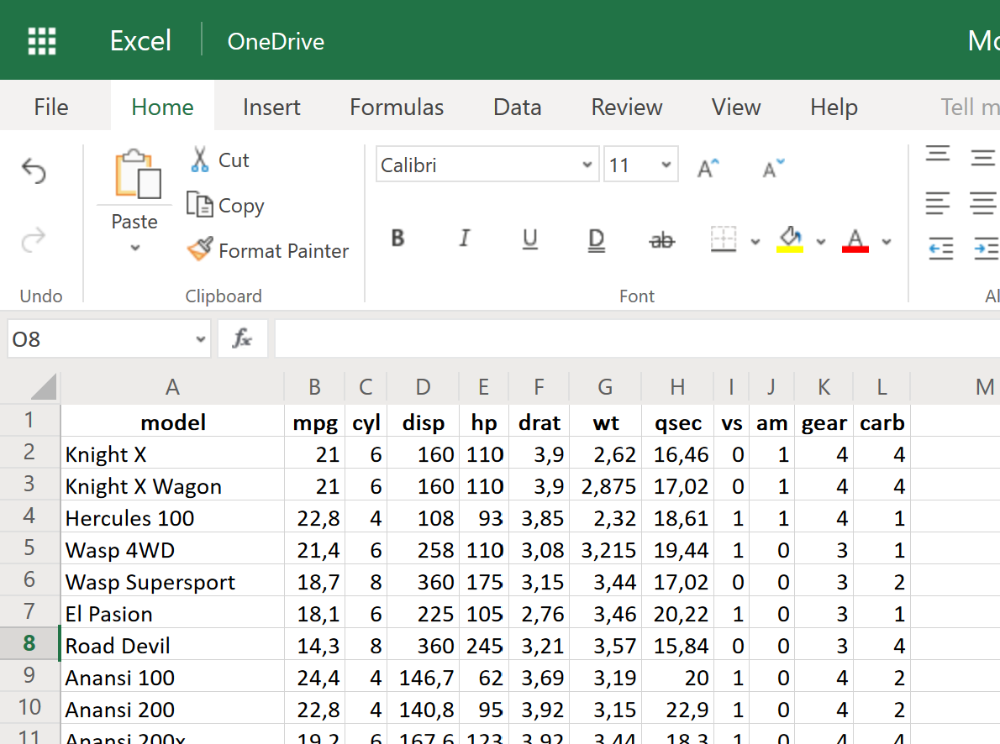
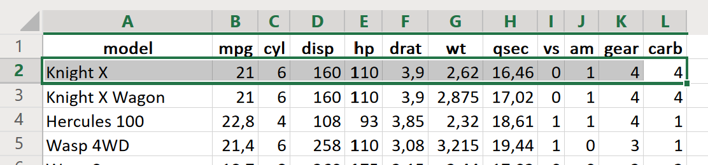
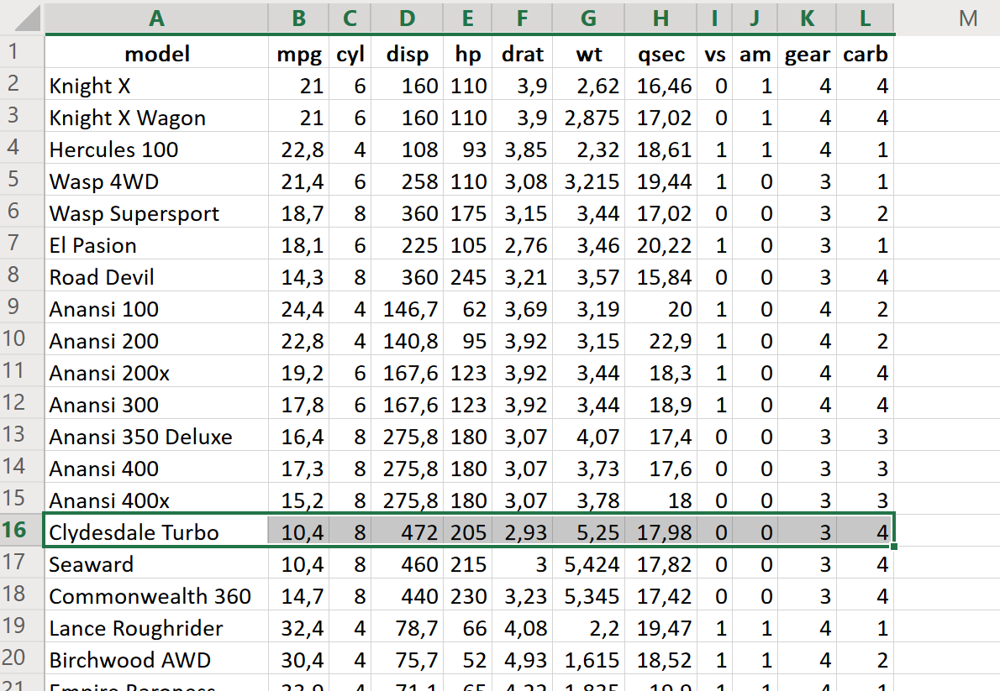
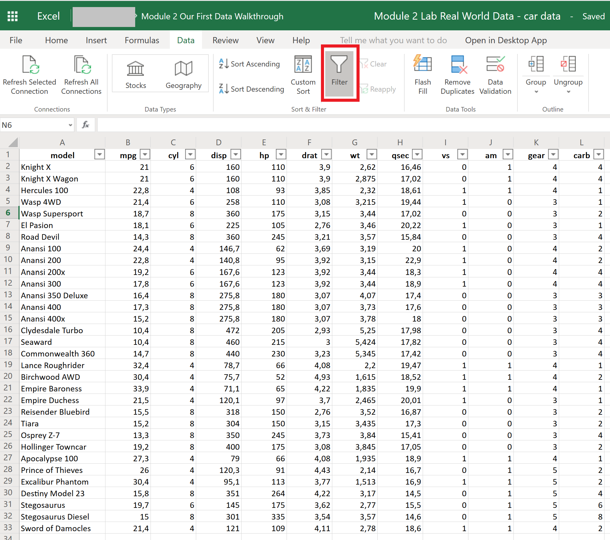
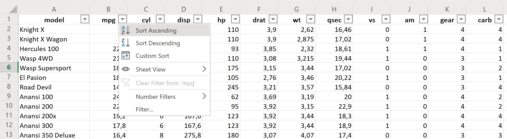
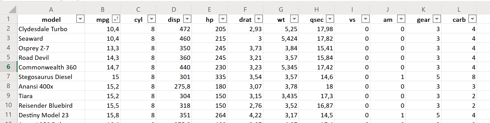

# A Practical Introduction to Data Analysis for Absolute Beginners

## Module 2 - Lab 1: Real World Data

## Learning Objectives

* Look at the basic anatomy of a data set with several variables.
* Sort that data according to one particular variable in Excel.

## Data Set

[Car data set](Module%202%20Lab%20Real%20World%20Data%20-%20car%20data.xlsx)
You can download this data set and store it so you can use it later on for the exercises.

## What You’ll Need

To complete the lab, you will need the online version of Microsoft Excel.

## Overview

In this lab, we’ll take a closer look at the car data we looked at in the videos. We’ll also see how to sort the data based on a specific variable/criteria, such as gas mileage.

### Exercise 1: Car Data

1. Go to Excel Online, and open the corresponding data using the "Upload and Open..." option. You should see several different variable columns for a group of car models. Please be aware of your local settings regarding the decimal separator and the thousand sign. Some countries use "," as a decimal separator, others use ".".

Here’s a snapshot of the data:

2. Identify the variables. In this case, there are 12 different vertical columns . Here’s what they each
represent:

model = name of car model
mpg = gas mileage, in miles per (US) gallon
cyl = number of cylinders
disp = displacement, in cubic inches
hp = gross horsepower
drat = rear axle ratio
wt = weight, in thousands of pounds (1000 lb)
qsec = 1/4 mile time
vs = engine (0 = V-shaped, 1 = straight)
am = transmission (0 = automatic, 1 = manual)
gear = number of forward gears
carb = number of carburetors

Those are your variables, since they vary from car to car.

3. Identify the observations. Since each horizontal row corresponds to a single entry from each of the variable columns, each row must represent an individual car model. For example, take a look at the first car on the list: the Knight X gets 21 miles per gallon, has 6 cylinders, 110 horsepower,
etc.

4. You can also answer simple questions about the data. For instance, how much does the Clydesdale Turbo weigh? To find out, track down “Clydesdale Turbo” in the model column, then
look over at column G, the weight column.

Remember, the weight variable (“wt”) is given in thousands of pounds, so multiply 5.25 by 1,000 to find the car’s weight.

5.25 × 1,000 = 5,250

The Clydesdale Turbo weighs in at 5,250 pounds.

5. What kind of horsepower does the Apocalypse 100 get? To find out, find that car model in the column on the far left, then look at column E to see the horsepower (“hp”).

Nice. That particular model gets 66 horsepower. Actually…that’s not so nice.

### Exercise 2: Sorting by MPG

Now we’ll rearrange the data so we can easily see which car models get the best and worst gas mileage.

1. With the data set open, click anywhere in the spreadsheet, go to the Data tab in the ribbon, and click Filter (in the Sort & Filter tab). You should now see a little dropdown arrow show up next to each column title, like this:

2. That arrow allows you to sort all the data by any single variable. We want to arrange the data based on gas mileage, so click the arrow next to “mpg” and select Sort Ascending.

3. Now the entire spreadsheet should rearrange itself, showing the car with the lowest gas mileage at the top and ascending downward. The great thing about this feature is that it shuffles all the data based on one particular column/variable.

4. With the data sorted like this, you can more easily see, for example, that the Clydesdale Turbo gets the lowest gas mileage out of any car on the list (10.4 miles per gallon). At the bottom of the list, you can see that the Empire Baroness gets the best gas mileage (33.9 miles per gallon).
We’ll go with the Baroness when we buy a new car.
