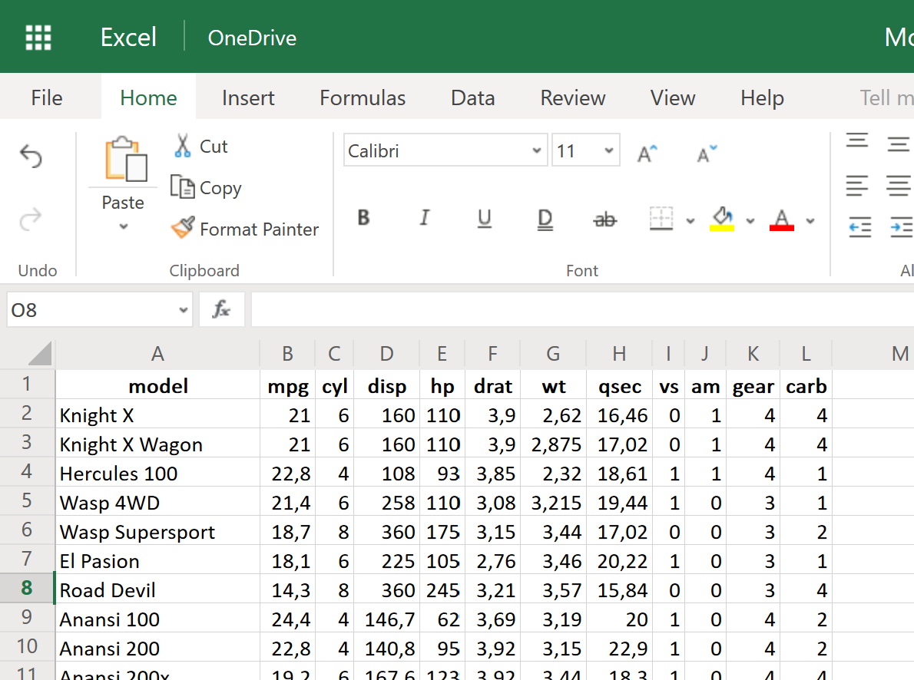
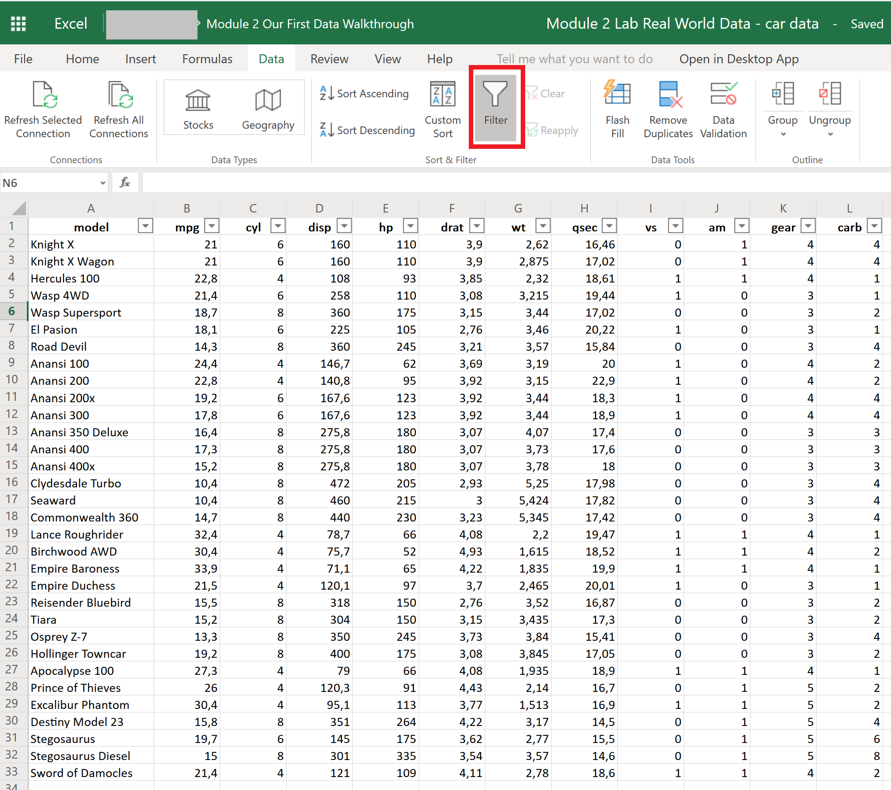
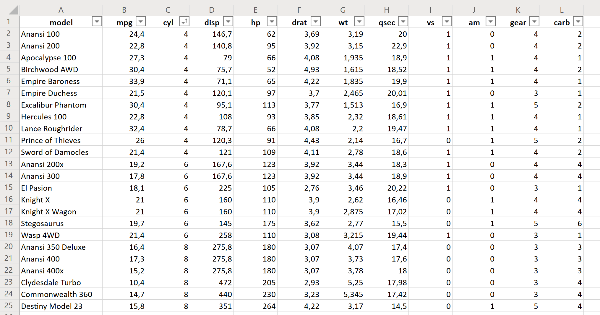
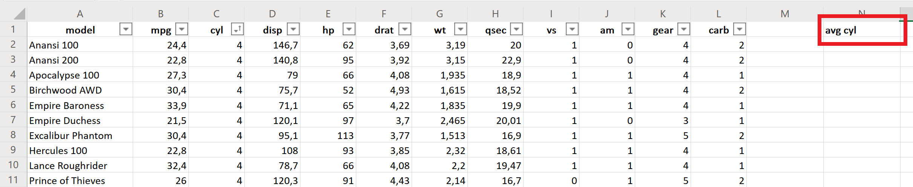

# A Practical Introduction to Data Analysis for Absolute Beginners

## Module 2 - Lab 2: Data Walkthrough

## Learning Objectives

* Analyze a real-world data set.
* Find the average of one particular variable in a data set.
* Create a scatterplot in Excel showing the relationship between two variables.
* Compute the correlation coefficient in Excel between two variables.

## Data Set

[Car data set](Module%202%20Lab%20Real%20World%20Data%20-%20car%20data.xlsx)
This is the same data set as you used for the prior lab.

## What You’ll Need

To complete the lab, you will need the online version of Microsoft Excel.

## Overview

In this lab, we’ll sort variables, average variables, and explore the relationship between two different
variables using our car data from the lesson. We’ll also play around a bit with visualizing our data in a scatterplot.

### Exercise 1: Sorting and Averaging by Engine Size

1. Go to Excel Online and open the file from the prior lab.

Here’s a snapshot of the data:

Once again, here’s what each variable/column represents:

model = name of car model
mpg = gas mileage, in miles per (US) gallon
cyl = number of cylinders
disp = displacement, in cubic inches
hp = gross horsepower
drat = rear axle ratio
wt = weight, in thousands of pounds (1000 lb)
qsec = 1/4 mile time
vs = engine (0 = V-shaped, 1 = straight)
am = transmission (0 = automatic, 1 = manual)
gear = number of forward gears
carb = number of carburetors

2. With the data set open, click anywhere in the spreadsheet, go to the Data tab in the ribbon, and click Filter (in the Sort & Filter tab). Probably, as you opened the file from the last lab, the filter option has already been activated.

3. Click the arrow next to the number of cylinders (“cyl”), then click Sort Ascending to sort the cars by engine size (number of cylinders they have).

It seems that the cars in our data have engine sizes that range from 4 to 8 cylinders.

4. Now find the mean/average number of cylinders among the cars on this list. Start by creating a new column for this average, out to the right-hand side of the rest of the data.

5. Use the AVERAGE function in Excel to find the mean/average number of cylinders. If you recall from our video lesson, the mean/average is just the sum of all the scores divided by the number of scores. Thankfully, Excel can crunch those numbers for us.

(Note: It’s not a requirement that you sort the data before averaging it. Sorting just makes everything easier to see.)

The syntax for Excel’s AVERAGE function is:

=AVERAGE(first cell:last cell)

Since you want the average number of cylinders, use column C as your range of data. You can either type in C2 as the first cell and C33 as the last cell, or you can just type in =AVERAGE( ), click inside the parentheses, and highlight all the cells from C2 down to C33. Once you hit Enter, the program will calculate the average for you from that column.

So the average car from this data set had about 6.1875 cylinders.
