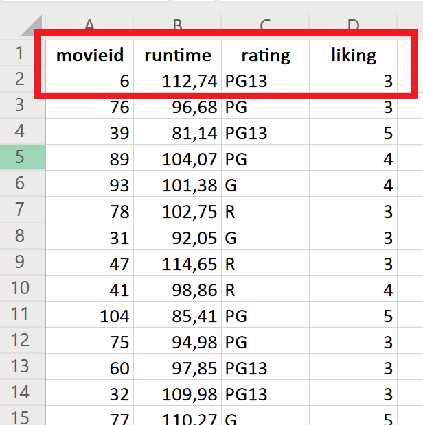

# A Practical Introduction to Data Analysis for Absolute Beginners

## Module 3 - Lab 1: Data Structures

## Learning Objectives

* Explore the anatomy of a data set.
* Identify which variables in a provided data set are nominal, ordinal, interval, and ratio.

## Data Set

[Movie data set](Module%203%20Lab%20Data%20Structures%20-%20movie%20data.xlsx)

You can download this data set and store it so you can use it later on for the exercises.

## What You’ll Need

To complete the lab, you will need the online version of Microsoft Excel.

## Overview

In this lab, we’re going to the movies. Using data on a number of different films, we’ll get familiar with the basic structure and anatomy of a data set. We’ll also explore and identify four basic types of data measurement: nominal, ordinal, interval, and ratio.

### Exercise 1: Reading Data

For starters, we’ll get our feet wet and look at the basic structure of a data set.

1. Open the data set in Excel Online. Remember, you can upload and open the file. You should see info on 104 different movies. Here’s a snapshot of what our tidy data set looks like, with a few different variables:

2. Identify the variables. In this case, there are four different vertical columns:

* movie ID
* runtime (in minutes)
* rating (G is the lowest (general audiences), followed by PG (parental guidance suggested), PG-13 (parents strongly cautioned), and R (restricted))
* liking (which gives the audience’s average ranking of the movie on a scale of 1–5, with 1 being the lowest)

Those are the variables because those values vary from movie to movie.

3. Identify the observations. Since each horizontal row corresponds to a single entry from each of the variable columns, each row must represent an individual movie. For example, Movie 6 at the top has a runtime of 112.74 minutes, is rated PG-13, and has an average likability of 3 out of 5
from the audience.

4. Now you can answer simple questions about the data set. For example, what’s the rating of Movie 84? To figure it out, hunt down 84 in the Movie ID column, then move along that movie’s row to the rating variable.

*Tip: in order to find Movie 84 quickly, you could use the Filter option like you learned in the prior lab. You could also sort the data set by "movieid".*

Movie 84 is rated PG.

5. How long is Movie 23? Head to the row for Movie 23 (it’s at the very bottom of the list), and check the runtime variable.

There you go! Movie 23 is 97.11 minutes long.
