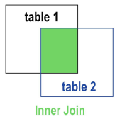
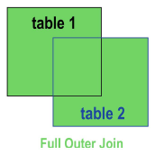
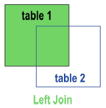
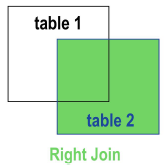
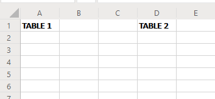
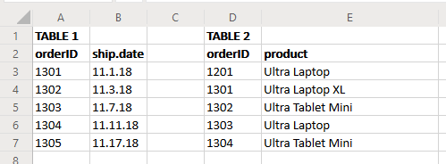
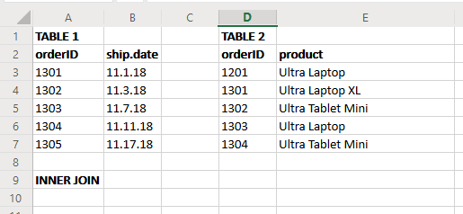
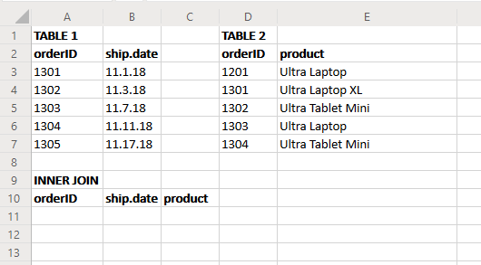
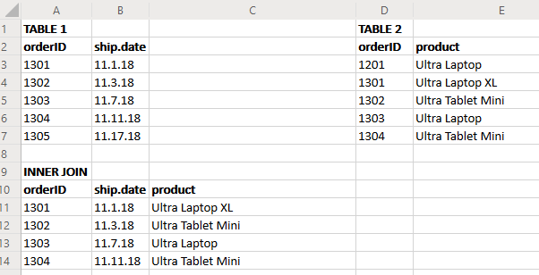

# A Practical Introduction to Data Analysis for Absolute Beginners

## Module 3 - Lab 2: Data Joins

## Learning Objectives

* Perform Inner Joins, Full Outer Joins, Left Joins, and Right Joins by hand in Excel.

## Data Set

There are two different data sets for this lab:

* [Table 1 data](Module%203%20Lab%20Data%20Joins%20-%20table%201%20data.xlsx)
* [Table 2 data](Module%203%20Lab%20Data%20Joins%20-%20table%202%20data.xlsx)

You can dowload the data files and store them on your local device. Then go to Excel Online, and open the corresponding data using the "Upload and Open..." option.

## What You’ll Need

To complete the lab, you will need the online version of Microsoft Excel.

## Overview

In data analysis, a “join” is a combination two (or more) tables into a single table, based on related columns in the tables. In this lab, we’ll practice manually performing four different types of data join in Excel. Before we get started, let’s run through a quick refresher on the definitions.

Here are four of the main types of join:

**Inner Join**: From two tables of data, this type of join returns a new table that only includes matching values from both tables. Any row or column that only shows up in one table (instead of both) will be ignored and not added to the join.

**Full Outer Join**: Also known as simply an Outer Join, this is basically the exact opposite of an Inner Join: It returns every single row and column from both tables, even if they don’t match the rows/columns in the other table. If there are rows without matching values, the new join table will return a “null” or “NA” entry for those cells (or simply be empty). A Full Outer Join will have the largest possible number of results.

**Left Join**: A special type of Outer Join where the “left” table (i.e. the table that’s listed first) is favored. That means it returns every row and column from the left table, but only matching rows from the right table.

**Right Join**: A special type of Outer Join where the “right” table (i.e. the table that’s listed second) is favored. It returns every row and column from the right table, but only matching rows from the left table.

### Exercise 1: Inner Joins

We’ll start by performing an Inner Join on the two data sets.

1. In a new blank worksheet in Excel Online, type TABLE 1 in cell A1, and type TABLE 2 in cell D1.
This’ll help keep your data sets straight.

2. Open both data sets in Excel (You can use "Upload and open..."). Copy and paste the data from the [Table 1 data set](Module%203%20Lab%20Data%20Joins%20-%20table%201%20data.xlsx) below TABLE 1, and copy and paste the [Table 2 data](Module%203%20Lab%20Data%20Joins%20-%20table%202%20data.xlsx) below TABLE 2.

3. Down in cell A9, type INNER JOIN.

4. Below that is where you’ll create your new table to represent the Inner Join. Now it’s time to think through what an Inner Join will look like with these two small data sets. Your Inner Join should be a new table that only includes matching values from both tables, ignoring any values that only show up in one table.

Your two tables both contain “orderID” values — that’s the common variable between Table 1 and Table 2. Table 1 pairs these order IDs with their ship dates, while Table 2 pairs each order ID with a product name. Since you’re “joining” the two tables, your new table should have columns for order ID, ship date, and product. Type those in, like so:

For example, order ID number 1301 was shipped on 11.1.18 (according to Table 1), and that same order included the Ultra Laptop XL product (according to Table 2, though note that order 1301 is in the second row of Table 2). The idea behind the join is that you want to have both these pieces of information in a single handy table.

5. Now figure out which data to include in the new Inner Join table. It’s not as simple as just copying all the data for both tables into the new one. Why not?

Check out those order ID numbers. Notice how both tables include the ID numbers 1301, 1302, 1303, and 1304 — but Table 1 includes 1305 as well, which is not in Table 2. Similarly, there’s an order ID number 1201 in Table 2 that doesn’t show up in Table 1. Since an Inner Join should ignore values that only show up in one table, you don’t want to include 1305 or 1201 in the new
table. Before looking at the next step below, see if you can copy and paste the correct data from Tables 1 and 2 to form the new **Inner Join table**.

6. Got it? Here’s what your Inner Join should look like:

We only included the info for orders 1301, 1302, 1303, and 1304 because the two original tables had those order numbers in common. Orders 1305 (in the bottom row of Table 1) and 1201 (in the top row of Table 2) get ignored.
Obviously this can get a lot more complex with larger data sets, but that’s the basic rundown of an Inner Join!
