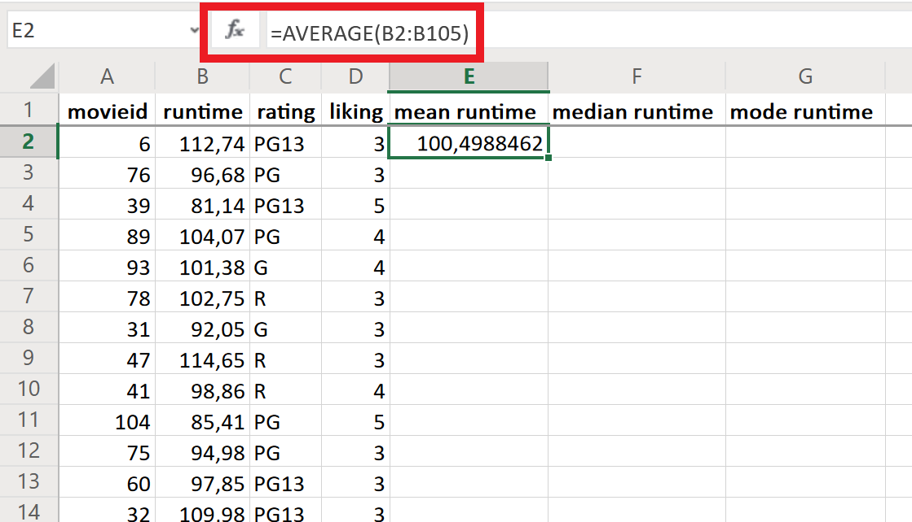

# A Practical Introduction to Data Analysis for Absolute Beginners

## Module 4 - Lab 1: Maths and Statistics

## Learning Objectives

* Calculate the mean, median, and mode in Excel.
* Calculate the standard deviation in Excel.
* Calculate the skewness variable in Excel.

## Data Set

[Movie data set](Module%203%20Lab%20Data%20Structures%20-%20movie%20data.xlsx)

You have used this data also for the prior labs of Module 3.

## What You’ll Need

To complete the lab, you will need the online version of Microsoft Excel.

## Overview

This lab is a crash course in the basics of some of the math concepts and summary statistics we’ll use for data analysis. We’ll tackle the three measures of center (mean, median, mode), standard deviation, and skewness. Buckle up!

### Exercise 1: Mean, Median, Mode

There are three ways to measure the “center” of a data set, and each uses a different type of logic. Here they are:

* **Mean**: The mean is the mathematical average of a data set: add up all the values, then divide that sum by the number of values. The mean is most useful when the data are fairly symmetric (i.e. normally distributed).

* **Median**: The median is the middle number in a data set (when all the values are arranged in order from least to greatest). If there are two values in the middle, the median is the average/mean of those two numbers. The median is usually used as a backup measure instead of the mean when the data are skewed or biased in some way.

* **Mode**: The mode is the most frequent value in the data set. For example, in the list 1, 2, 2, 4, 5, the mode is 2 because 2 shows up more often than the other values. The mode isn’t particularly useful with numerical data, but it’s very helpful with categorical data because it shows which category was the most popular.

Let’s run through all three of these measures in Excel, using the movie runtime data we used back in Module 3.

1. Open the data set in Excel, which shows 104 different movies along with their runtime (in minutes), rating, and liking (which gives the audience’s average ranking of the movie on a scale of 1–5, with 1 being the lowest). Here’s what the first few entries look like:

2. Create three new columns for the mean, median, and mode of the “runtime” variable.

3. In the “mean runtime” column (in cell E2), find the mean of all the values in column B. To do this, use Excel’s AVERAGE function. The syntax is **=AVERAGE(first cell:last cell)**.

*Please note that the syntax also depends on your language: some languages use ";" instead of ":".*

In this case, you want the mean of every single value in the “runtime” column, so the first cell is B2 and the last cell is B105. You can either type B2:B105 directly inside the parentheses of the AVERAGE function, or you can just click inside the parentheses and highlight all the cells from B2 to B105. When you hit Enter, Excel will calculate the average for you in cell E2.

Explanation of this value: The average length of these 104 movies was about 100.5 minutes (when we round the value to one decimal place).

4. Now find the median runtime using the MEDIAN function. It works pretty much the same as the mean: The syntax is **=MEDIAN(first cell:last cell)**. You’re still looking at the runtime data, so click into cell F2 and type =MEDIAN(B2:B105), then hit Enter.

See how the value of the median is slightly different than the mean? Sometimes they’ll be the same, but not this time. What this means is that the middle value in the data set is 100.71 minutes.

5. Find the mode of the runtime data, which is the value that shows up the most often. (There can be more than one mode if multiple values show up with the same frequency.) Excel’s
MODE.SNGL function gives the single most frequently-occurring number in a data set, so let’s use that. The syntax is **=MODE.SNGL(first cell:last cell)**. Once again, you’re looking at the runtime values in column B, so the first cell is B2 and the last cell is B105.

This means that 98.86 minutes is the most common movie length in our list. For this data set, we had different values for the mean, median, and mode, but you’ll often see two or even all three of these values being exactly the same. It just depends on how skewed the data are (more on this later, in Exercise 3).

