# A Practical Introduction to Data Analysis for Absolute Beginners

## Module 4 - Lab 2: Data Visualization

## Learning Objectives

* Use Excel Online to create line graphs, histograms, and bar graphs.

## Data Set

[Movie data set](../Module%203%20Our%20Data%20Structures/Module%203%20Lab%20Data%20Structures%20-%20movie%20data.xlsx)

You have used this data also for the prior labs of Module 3. In case you haven't, you can dowload this data file and store it on your local device. Then go to Excel Online, and open the corresponding data using the "Upload and Open..." option.

## What You’ll Need

To complete the lab, you will need the online version of Microsoft Excel.

## Overview

In this lab, we’ll create three different types of visualization for the movie data we looked at in the previous lesson’s lab.

### Exercise 1: Line Graphs

We’ll start things out by creating a simple line graph showing how all the movie runtimes relate to each other.

1. Open the data set in Excel, which shows 104 different movies along with their runtime (in minutes), rating, and liking score. Here’s what the first few entries look like:

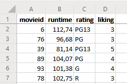

2. Before creating your graph, it’ll make things easier to read if you first sort all this data by the movie ID numbers. Click into cell A1, then go to the ribbon and click on Data and then select Filter.

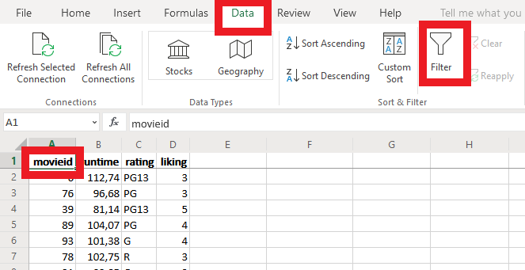

A dropdown arrow should now appear next to each of the column titles.

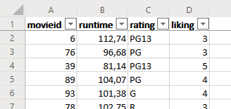

3. Click the arrow next to “movieid” in column A, then choose Sort Ascending.

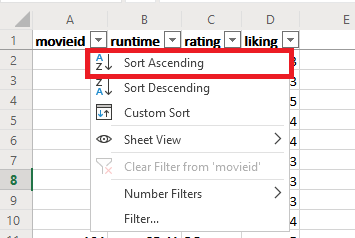

Once you’ve clicked Sort Ascending, all the data should rearrange itself by movie ID number.

4. With that step out of the way, you’re ready to create your line graph. Highlight all the data in the “runtime” column (column B). Make sure all 104 movie runtimes are highlighted.

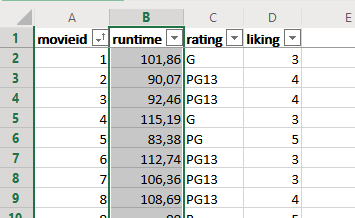

5. With column B highlighted, click on the Insert tab in the ribbon. In the Charts section, click Line > Line with Markers (the icon in the lower-left corner).

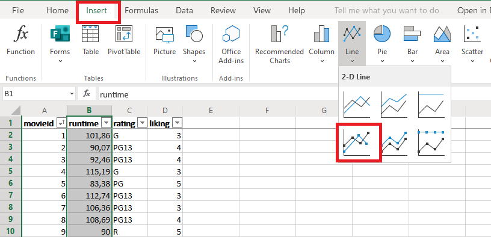

On that same spreadsheet, you should now see a graph showing each movie’s runtime (on the vertical axis) and ID (on the horizontal axis).

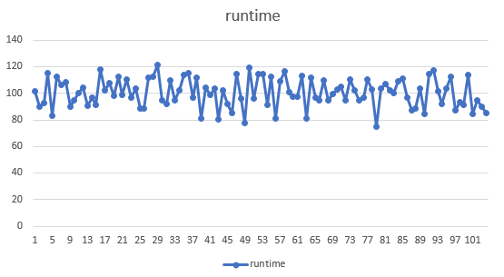

6. Finish up by adding titles to each axis, which will make things easier to read. Click on the graph itself, then click Chart Tools > Axis Titles > Primary Horizontal Axis Title > Edit Horizontal Axis Title.

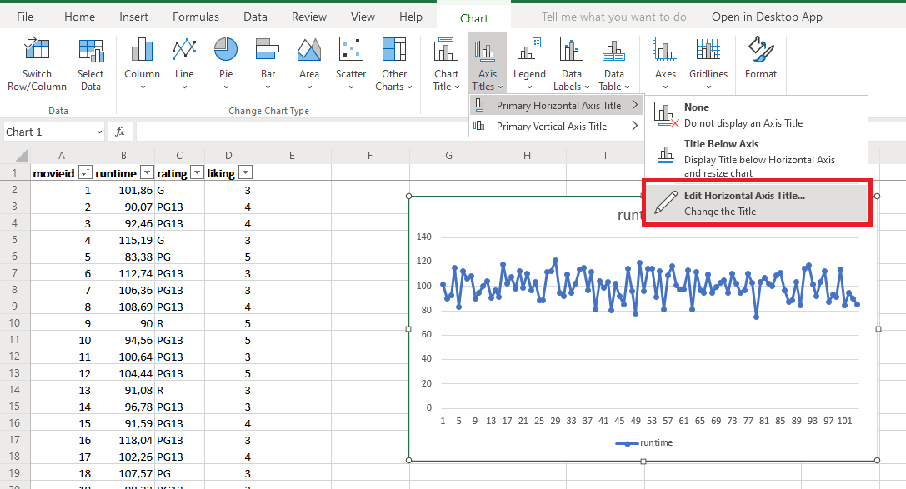

In the Title Text box, type in “Movie ID” and hit OK.

7. Do the same thing for the vertical axis. Click on the graph itself, then click Chart Tools > Axis Titles > Primary Vertical Axis Title > Edit Vertical Axis Title. In the Title Text box, type in “Movie runtime (in minutes)” and hit OK.

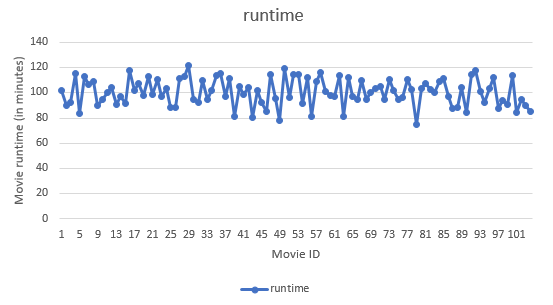

Now you’ve got a nice, easy-to-read graph showing each movie’s length, in minutes. Each dot on the graph represents one movie. With this data visualization, it’s easier to see that most of the movies fall between about 80 and 120 minutes in length, with a handful of outliers outside this range.

Bonus question: you might want to give the chart a better title. Can you figure out how to do that?

### Exercise 2: Histograms

The next type of graph we’ll look at is the histogram. We’ll use the movie runtime data again, but now we’ll see it in a different light.

1. In that same data set from Exercise 1 (with the data already sorted by movie ID), highlight everything in the “runtime” column again. Once again, make sure all 104 movie runtimes are highlighted.

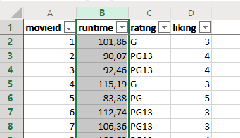

2. With everything in column B highlighted, click the Insert tab in the ribbon and select Other Charts from the Charts section. Choose Histogram from the dropdown menu (it’s the first option under Statistical).

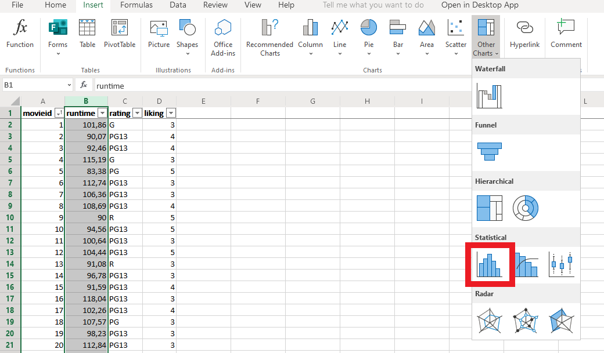

3. After clicking on the histogram icon, a new graph should pop up, like this:

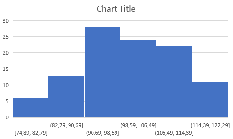

It might look a little confusing at first, but here’s how it works: The horizontal axis along the bottom shows different ranges, or bins , of movie runtimes. For example, the bin on the far left (the one labeled [74.89, 82.79]) represents all the movies that were between 74.89 minutes and 82.79 minutes.

The vertical axis on the left shows the number of movies that fall into each bin category. For example, the blue bar on the far left is slightly above the marker for “5,” which means that just over 5 movies on the list were between 74.89 minutes and 82.79 minutes long.

Notice how the program automatically chooses the bins for you based on an even distribution of the data. Sadly, you can’t change the bin size in Excel Online (though if you have a desktop version of Excel, you can click Edit in Excel in the ribbon to specify the bin width). Those decimals are a little messy, but they’ll do the job.

4. Now let’s clean this histogram up by adding some helpful labels, exactly like we did in the previous exercise. Make sure you click on the histogram first to get the Chart Tools visible in your top menu.

* Under Chart Tools > Axis Titles, you can add titles for the vertical and horizontal axes. Make sure you click on the graph itself first.
* Click Chart Tools > Axis Titles > Primary Horizontal Axis Title > Edit Horizontal Axis Title, type in “Movie runtime (in minutes)” in the box, then click OK.
* Then click Chart Tools > Axis Titles > Primary Vertical Axis Title > Edit Vertical Axis Title, type in “Number of movies” in the box, then click OK. Your histogram should now look like this:

Much better, but let’s add a couple more helpful labels.

5. Click on the histogram again, then go to Chart Tools > Chart Title > Edit Chart Title. Type in “Movie Runtime” and hit OK.

6. There’s one other helpful label you can add to this histogram. Click on the graph, then choose Chart Tools > Data Labels > Outside End.

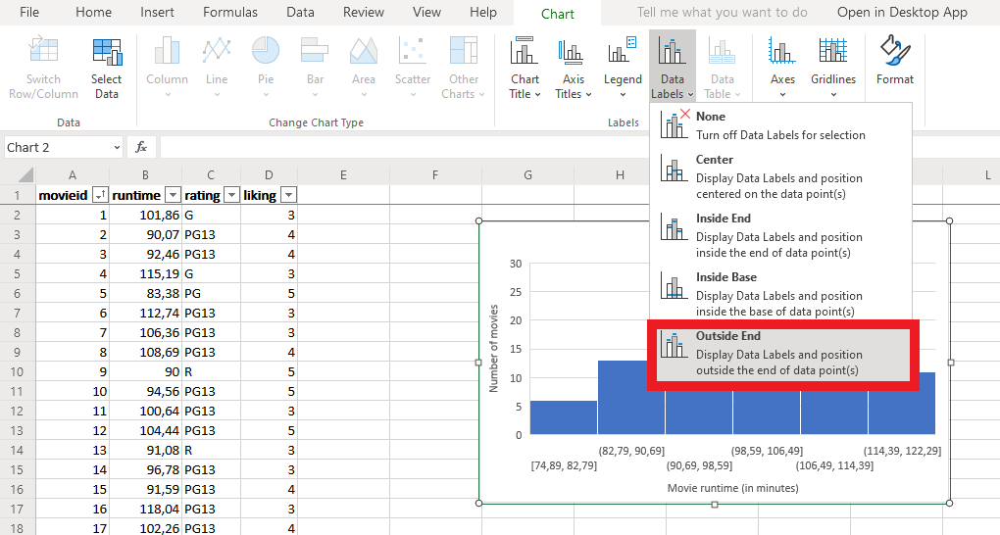

This will add an actual count for each category above each bin, like so:

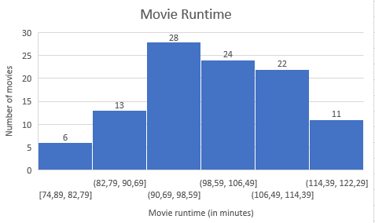

Now you can see exactly how many movies fell into each category. For example, there were 28 movies that were between 90.69 minutes and 98.59 minutes.

### Exercise 3: Bar Graphs

Sometimes, we have data that’s categorical instead of numerical — it falls into categories that don’t have any numerical value. One example is the movie rating data from this lab’s data set, which shows whether each movie was rated G, PG, PG13, or R. These ratings aren’t numbers, so we can’t use a histogram to visualize them. But we can use a different type of visualization: a bar graph.

1. Before you can create a new bar graph for the movie rating data, you’ll need to rearrange the data a bit. Why? Because Excel Online’s bar graph feature needs some actual numbers to read. Create a new mini-table off to the side with a row for each of the four movie rating categories (G, PG, PG13, and R), like so:

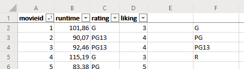

2. Now populate each category by applying the COUNTIF function to the “rating” variable in column C. What this function does is count the number of times a specific value or term shows up in a range of cells. The syntax is **=COUNTIF(range, criteria)**, where the range is the first and last cell separated by a colon. For example, to count the number of movies that were rated G, enter the range as C2:C105 (to represent everything in the “rating” column), and then enter your criteria as “G”. Do this in cell G1.

**Important note: Since the criteria you want involves text instead of numbers, make sure you put “G” in quotation marks.**

So here’s what you should type in cell G1: **=COUNTIF(C2:C105,"G")**. 
Once you hit Enter, that cell will show the number of movies that were rated G.

Remember: the syntax depends on the language you are using, so in come cases, the formula will be: **=COUNTIF(C2:C105;"G")**.

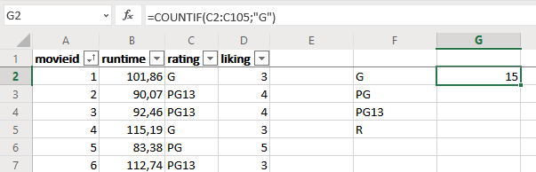

There we go: 15 movies were rated G.

3. In cell G2, use the COUNTIF function again to count the number of movies with a PG rating. Use the same syntax as you did in step 2.

Syntax to use: **=COUNTIF(C2:C105,"PG")**

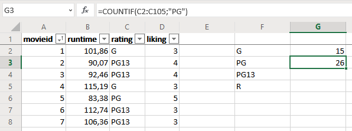

4. In cell G3, repeat step 2 to count the number of movies with a PG13 rating. Again, don’t forget to put “PG13” in quotation marks. For sure, you are now able to write the syntax yourself. Remember to check whether to use a "," or a ";" in your formula.

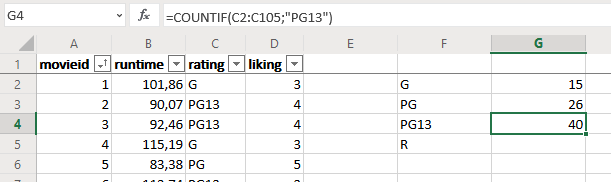

5. In cell G4, repeat step 2 one more time to count the number of movies with an R rating.

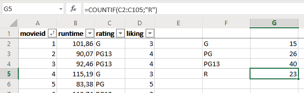

Sure enough, if you add up those four categories, you get 15 + 26 + 40 + 23 = 104 movies, which was the total number of movies in this data set. We didn’t miss anything.

6. It’s time to actually create the **bar graph**. Highlight that whole mini-table you created in the previous steps.

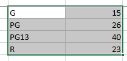

In the ribbon, click Insert > Column > Clustered Column. It’s the graphic on the left side of the dropdown menu.

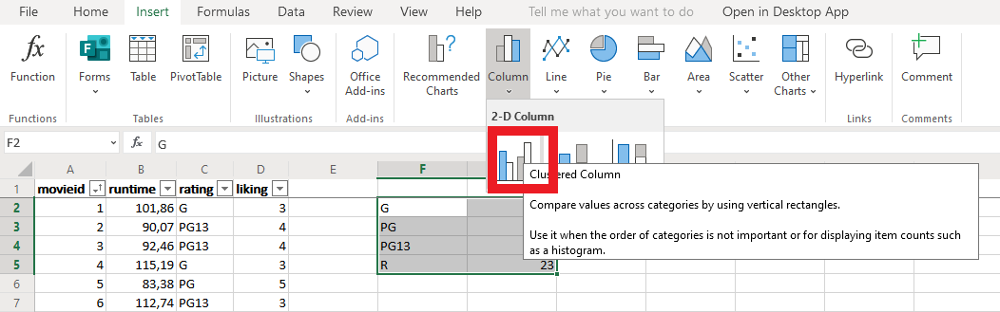

Bam! Your new bar graph should pop up.

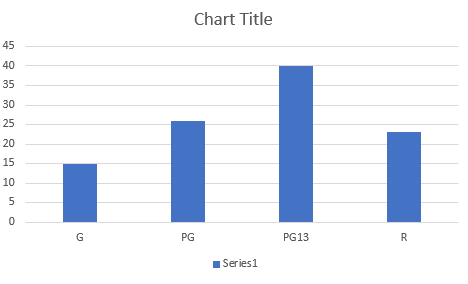

The ratings are shown along the horizontal axis on the bottom, while the number of movies in each category is shown along the vertical axis on the left.

7. As usual, it’s a good idea to add some helpful labels to the graph before finishing up. Just like you did in Exercises 1 and 2, add a quick title for the horizontal and vertical axes.

* Click Chart Tools > Axis Titles > Primary Horizontal Axis Title > Edit Horizontal Axis Title, type in “Rating” in the box, then click OK.
* Then click Chart Tools > Axis Titles > Primary Vertical Axis Title > Edit Vertical Axis Title, type in “Number of Movies” in the box, then click OK. Your bar graph should now look like this:

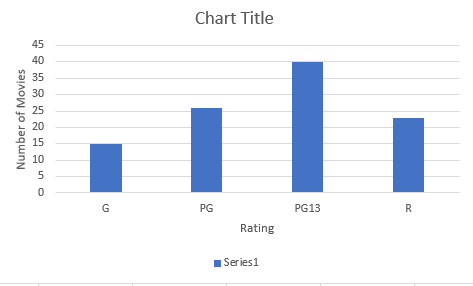

Now you can see how the movie ratings stack up against each other. It looks like the most popular rating was PG13, followed by PG, then R, then G.

Bonus: Give the chart a nice title too!
