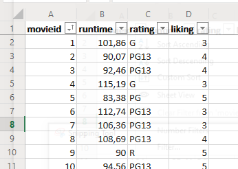

# A Practical Introduction to Data Analysis for Absolute Beginners

## Module 4 - Lab 2: Data Visualization

## Learning Objectives

* Use Excel Online to create line graphs, histograms, and bar graphs.

## Data Set

[Movie data set](../Module%203%20Our%20Data%20Structures/Module%203%20Lab%20Data%20Structures%20-%20movie%20data.xlsx)

You have used this data also for the prior labs of Module 3. In case you haven't, you can dowload this data file and store it on your local device. Then go to Excel Online, and open the corresponding data using the "Upload and Open..." option.

## What You’ll Need

To complete the lab, you will need the online version of Microsoft Excel.

## Overview

In this lab, we’ll create three different types of visualization for the movie data we looked at in the previous lesson’s lab.

### Exercise 1: Line Graphs

We’ll start things out by creating a simple line graph showing how all the movie runtimes relate to each other.

1. Open the data set in Excel, which shows 104 different movies along with their runtime (in minutes), rating, and liking score. Here’s what the first few entries look like:

2. Before creating your graph, it’ll make things easier to read if you first sort all this data by the movie ID numbers. Click into cell A1, then go to the ribbon and click on Data and then select Filter.

A dropdown arrow should now appear next to each of the column titles.

3. Click the arrow next to “movieid” in column A, then choose Sort Ascending.

Once you’ve clicked Sort Ascending, all the data should rearrange itself by movie ID number.

4. With that step out of the way, you’re ready to create your line graph. Highlight all the data in the “runtime” column (column B). Make sure all 104 movie runtimes are highlighted.

5. With column B highlighted, click on the Insert tab in the ribbon. In the Charts section, click Line > Line with Markers (the icon in the lower-left corner).

On that same spreadsheet, you should now see a graph showing each movie’s runtime (on the vertical axis) and ID (on the horizontal axis).

6. Finish up by adding titles to each axis, which will make things easier to read. Click on the graph itself, then click Chart Tools > Axis Titles > Primary Horizontal Axis Title > Edit Horizontal Axis Title.

In the Title Text box, type in “Movie ID” and hit OK.

7. Do the same thing for the vertical axis. Click on the graph itself, then click Chart Tools > Axis Titles > Primary Vertical Axis Title > Edit Vertical Axis Title. In the Title Text box, type in “Movie runtime (in minutes)” and hit OK.

Now you’ve got a nice, easy-to-read graph showing each movie’s length, in minutes. Each dot on the graph represents one movie. With this data visualization, it’s easier to see that most of the movies fall between about 80 and 120 minutes in length, with a handful of outliers outside this range.

Bonus question: you might want to give the chart a better title. Can you figure out how to do that?
