# A Practical Introduction to Data Analysis for Absolute Beginners

## Module 5 - Lab 1: Healthcare Data

## Learning Objectives

* Use the AVERAGE function to find the mean/average of a single variable in a data set.
* Use the AVERAGEIF function to find the mean/average of one variable based on certain criteria in a second variable.
* Create a bar graph to visualize data.

## Data Set

[Healthcare data set](Module%205%20Lab%20Healthcare%20-%20healthcare%20data.xlsx)

You can download this data set and store it so you can use it later on for the exercises.

## What You’ll Need

To complete the lab, you will need the online version of Microsoft Excel.

## Overview

Imagine that you’re a data analyst who’s been hired by a small medical practice to analyze the efficiency of four different doctors. The data set in question shows the morning schedules of these four doctors — Jessica, Fatima, Haruto, and Benjamin — over the course of a single week, as well as the duration of
their appointments with each patient.

In this lab, your job is to analyze each doctor’s average time per patient, decide which doctor is the most efficient in terms of time, and create a visual aid to show these averages.

### Exercise 1: Total Average Duration

1. Open the data set in Excel (remember, use the "Upload and Open..." option), which shows the appointment times and durations for the patients of four different doctors. Here’s a snapshot of the data:

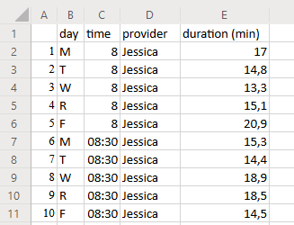

*Note: please remember that based on your language/country and decimal seperator settings, you might see a "." instead of a ",".*

Each row represents one patient (there should be 160 different patients). Here’s what each column represents:

* day = the day of the week (note: T = Tuesday, and R = Thursday)
* time = the appointment time (a.m.)
* provider = the doctor’s name (either Jessica, Fatima, Haruto, or Benjamin)
* duration (min) = the length of the appointment, in minutes

The untitled column A values give the patient number for ID purposes. Notice that these patient numbers are slightly different than the actual row numbers — so Patient 1 is actually in row 2 of the spreadsheet, because all the column titles are in row 1.

2. Start out by creating a new mini-table off to the side of the data (in the same spreadsheet), with columns for each provider, the total average appointment duration from that provider, and the average appointment from that provider for each day of the week (M, T, W, R, F). It should look something like this:

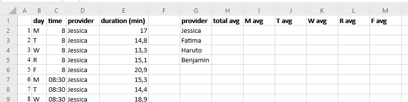

3. Next, click into cell H2 and find Jessica’s average appointment duration using the AVERAGE function in Excel. The syntax here is **=AVERAGE(first cell:last cell)**. The duration data are in column E.
The first 40 patients were Jessica’s, so your first cell is E2 and your last cell is E41. (Remember, the cell numbers are 1 digit off from the patient number, so Patient 1 is in row 2.) You can either type those cells directly into the AVERAGE function (with a colon in between), or just type in =AVERAGE(), click inside the parentheses, and highlight the whole range of cells between E2 and E41. Either way is fine. Hit enter after entering your formula to get the result.

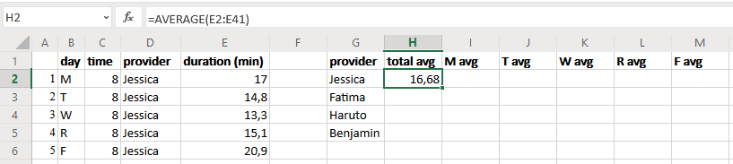

The average amount of time that Jessica spent with each patient was 16.68 minutes.

4. Now find the total average for the second doctor, Fatima. Click into cell H3 and use the AVERAGE function again. You’ll still use the duration data from column E, but this time, you want Fatima’s patients, who run from cell E42 down to E81. Hit enter after entering your formula to get the result.

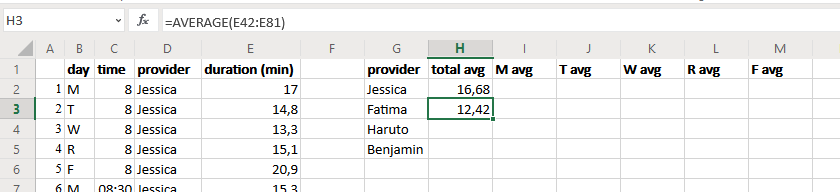

Fatima spent an average of 12.42 minutes per patient.

5. Haruto’s up next. Click into cell H4 and use the AVERAGE function on Haruto’s patients, who run from E82 to E121.

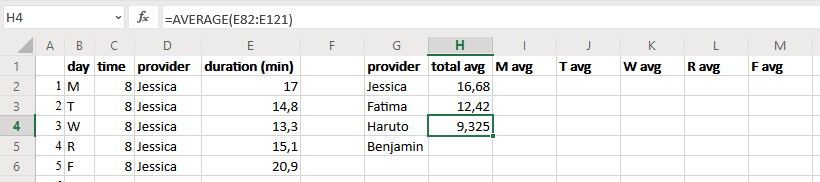

Haruto was really hustling, with an average duration of 9.325 minutes per patient.

6. Finish up with Benjamin’s average in cell H5. Once again, use the AVERAGE function. Benjamin’s patients run from E122 all the way down to E161.

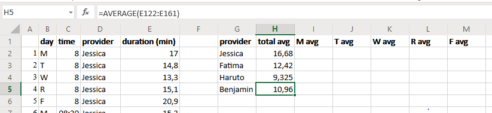

Benjamin spent an average of 10.96 minutes with each patient.

Side note: always think of what you are looking at. In this case, you are only looking at duration. But an important factor is missing: what is the quality of that time spent with a patient? So even while Haruto was quick, he might have very content patients. On the other hand, Jessica spent more time on average on a patient, but that does not tell you whether the quality is higher or not.

### Exercise 2: Daily Average Duration

Now we’ll track down each doctor’s average duration by the day of the week.

1. Using that same new table you created in Exercise 1, click into cell I2, which you’ll use for Jessica’s average duration per patient on Monday only . This might sound tricky, but Excel Online has another fancy function that’ll do it nicely: AVERAGEIF, which finds the average based on certain criteria in the data.

The syntax is slightly more complicated for this function:

`=AVERAGEIF(criteria range, criteria, average range)`

Here’s what each part means:
criteria range = the range of cells to test with the criteria, with a colon between them (first cell:last cell)

**criteria** = the condition you want to use to narrow down the variable in the criteria range (if the criteria involves text instead of numbers, stick the text in quotation marks)

**average range** = the range of cells that you actually want to average, with a colon between them (first cell:last cell)

For example, in cell I2 you want to find Jessica’s average duration on Monday only, so the criteria range is the “day” variable (column B, but only the cells from Jessica’s patients). The criteria is Monday (“M”). The average range is the “duration” variable (column E, but again, only the cells from Jessica’s patients). Put it all together, and you get:

`=AVERAGEIF(B2:B41,"M",E2:E41)`

Don’t forget to put the “M” in quotation marks, since it’s text instead of a number. Once you hit Enter, Excel will calculate the average duration from Jessica’s patients, but only the ones she saw on Monday.

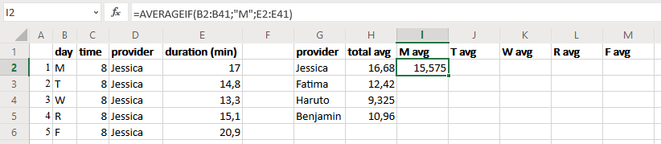

Beautiful. On Monday, Jessica spent an average of 15.575 minutes with each patient.

2. Now use this formula and adapt it for the other days of the week for Jessica. The AVERAGEIF function will stay nearly the same for Jessica’s other days: Her criteria range is always B2:B41, and her average range is always E2:E41. The only thing that changes is the criteria itself: Tuesday = “T” instead of “M”, etc. This’ll go in the “T avg” column (cell J2).

*Tip: you can select and copy the formula in the formula bar, and paste it in the formula bar directly of the next weekday cell you want to calculate, and then change the weekday. Don't copy it into the cells of the worksheet, as that will change also the selection ranges.*

Once you’ve entered all the formulas correctly, here’s what you should get for Jessica’s daily averages:

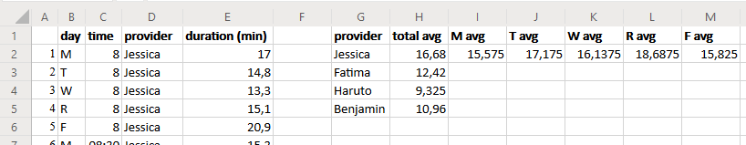

3. Repeat Steps 1 and 2 for Fatima. This time, Fatima’s criteria range runs from B42:B81, and her average range runs from E42:E81.

With all the formulas entered, your table should now look like this:

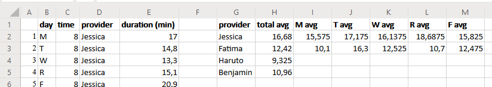

4. Repeat those steps again for Haruto. The criteria range runs from B82:B121, and the average range runs from E82:E121.

With Haruto’s part all entered, your table should look like this:

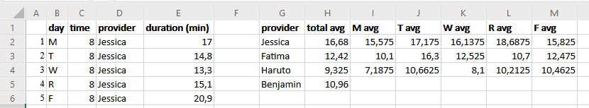

5. Repeat those steps one last time for Benjamin. Don’t give up! Almost there! Benjamin’s criteria range is B122:B161, and his average range is E122:E161.

Our table is finally done!

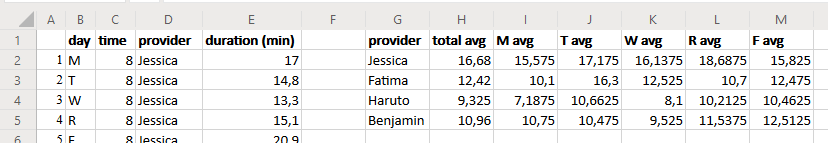

Now you can see how everyone’s weekly and daily average times stack up against each other. But a visual aid will make these comparisons even easier to see.
