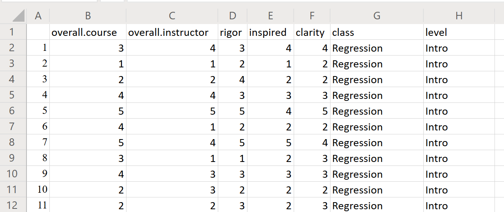
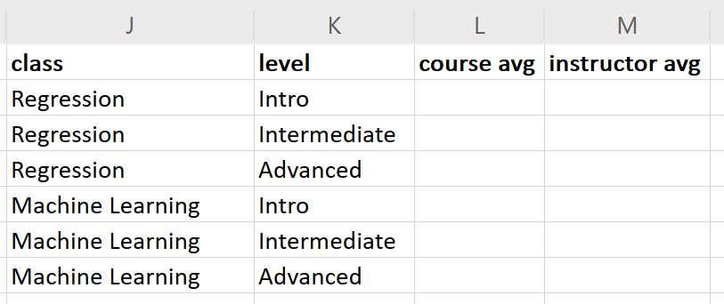
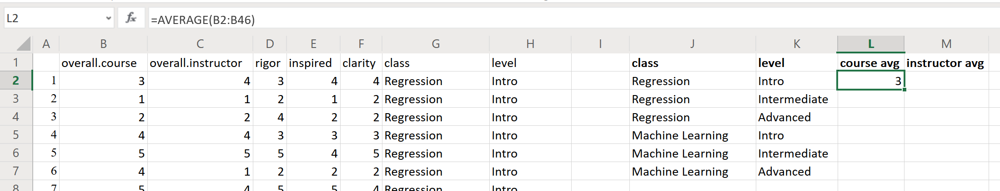
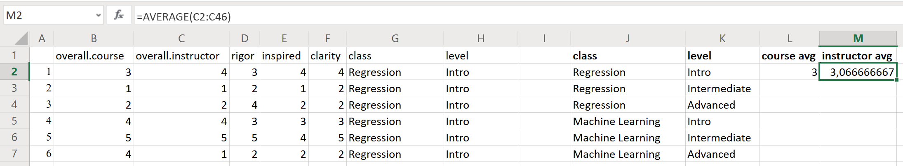
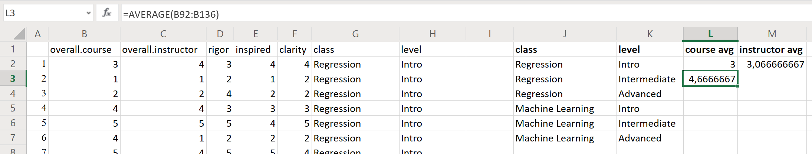
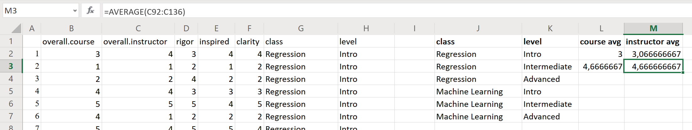
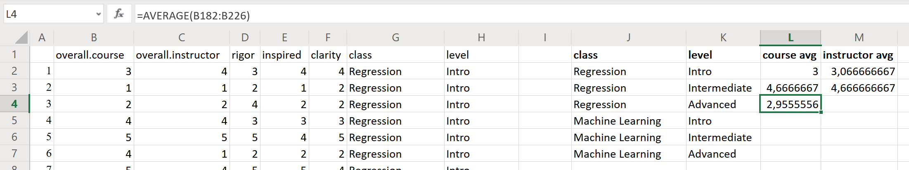
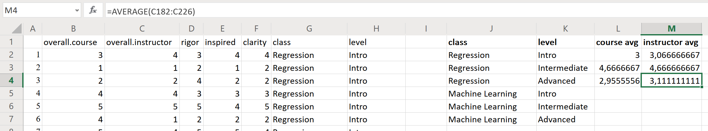
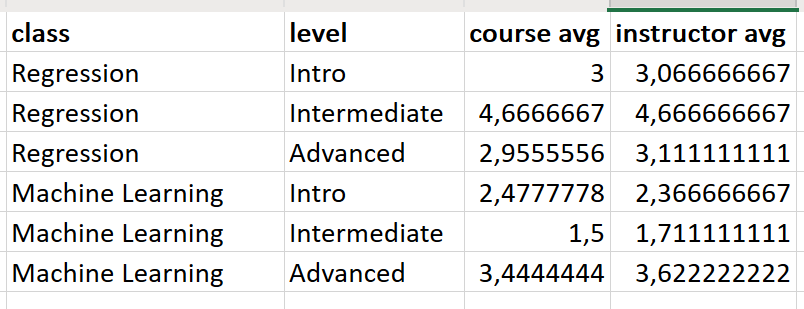

# A Practical Introduction to Data Analysis for Absolute Beginners

## Module 5 - Lab 2: Education Data

## Learning Objectives

* Find the mean/average ranking among different variables in a data set.
* Create a line graph to visualize data.

## Data Set

[Education data set](Module%205%20Lab%20Educatione%20-%20education%20data.xlsx)

You can download this data set and store it so you can use it later on for the exercises.

## What You’ll Need

To complete the lab, you will need the online version of Microsoft Excel.

## Overview

Imagine that you’re a data analyst at a university, and you’re looking at data from six different courses from one particular instructor: This instructor is teaching intro, intermediate, and advanced versions of two classes (“Regression” and “Machine Learning”). The data show the results of post-course surveys that each student took, where they ranked different aspects of the class on a scale of 0 to 5.

In this lab, you’ll help the instructor see how the students ranked each course overall, how they ranked
the teacher, and how each course stacked up against the others.

### Exercise 1: Class and Teacher Rankings

1. Open the data set in Excel, which shows the results of a post-course survey from 270 different students. Here’s a snapshot of the data:

Each row represents one student’s survey results (there should be 270 different students).

Here’s what each column represents:

* overall.course = the student’s ranking of the course as a whole (on a scale from 0 to 5)
* overall.instructor = the student’s ranking of the instructor/teacher during that course (on a
scale from 0 to 5)
* rigor = the student’s ranking of the course difficulty/exhaustiveness (on a scale from 0 to 5)
* inspired = the student’s ranking of how inspired they felt after taking the course (on a scale from
0 to 5)
* clarity = the student’s ranking of how clear the course materials were (on a scale from 0 to 5)
* class = the title of the course (either Regression or Machine Learning)
* level = the level of the course (either Intro, Intermediate, or Advanced)

The untitled column A values give the student number for ID purposes. Notice that these student numbers are slightly different than the actual row numbers — so Student 1 is actually in row 2 of the spreadsheet, because all the column titles are in row 1.

2. Now you want to look at the class averages from two of these variables: overall course and overall instructor. To do this, find the average (mean) ranking for “overall.course” and for “overall.instructor” — but break it down by each of the six class types. Those six classes are:

* (1) Regression Intro
* (2) Regression Intermediate
* (3) Regression Advanced
* (4) Machine Learning Intro
* (5) Machine Learning Intermediate
* (6) Machine Learning Advanced

Thankfully, the data are already arranged by course. Set up a new table off to the side of the data (in the same spreadsheet), with columns for each course, level, average overall course score, and average overall instructor score. It should look something like this:

3. Click into cell L2. In that cell, use Excel’s AVERAGE function to find the average/mean value of “overall.course” (column B) for all the students in the class Regression (column G) and level Intro (column H).

The syntax here is `=AVERAGE(first cell:last cell)`.

Since only the first 45 students in the list took the Regression Intro course, your first cell is B2 and your last cell is B46. You can either type those cells directly into the AVERAGE function (with a colon in between), or just type in =AVERAGE( ), click inside the parentheses, and highlight the whole range of cells between B2 and B46. Either way works.

Hit Enter and Excel will calculate the average ranking.

There we go. The average score from the students in the Regression Intro course was a 3 (out of 5).

4. Now find the average instructor score for that same course (Regression Intro). Use the AVERAGE function again. This time, you want the ranking each student gave for the instructor (column C), so your cell range runs from C2 to C46. Then hit Enter.

The average ranking for the instructor in the Regression Intro course was roughly 3.07 when rounded to two decimal places.

5. Run through the same steps for the Regression Intermediate course. You’ll need to scroll down a
bit to find the students in this class: Regression Intermediate runs from Student 91 to Student 135. Use the AVERAGE function again with cells B92 to B136 to find the course average. (Remember, the cell numbers are 1 digit off from the student number, so Student 91 is in row 92.) Hit Enter again.

The students in the Regression Intermediate class gave the course an average score of about 4.67 (out of 5). Not too shabby!

6. Find the instructor average for that same set of students. This time, use C92 to C136 as your cell range, since you’re looking at the “overall.instructor” data for the Regression Intermediate class.

The students in this course gave the teacher an average ranking of about 4.67 (out of 5).

7. Repeat those same steps for the other four courses, paying careful attention to the cell ranges and column names. Here’s what you’ll use for the Regression Advanced course:

Course average:

Instructor average:

8. Repeat the same steps for the Machine Learing course data and complete the table.

Let's see how it looks like...

Did you get the same results?
