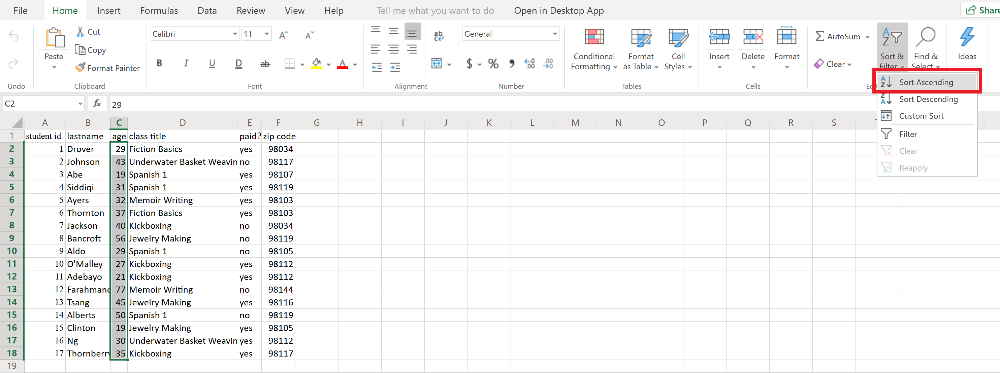
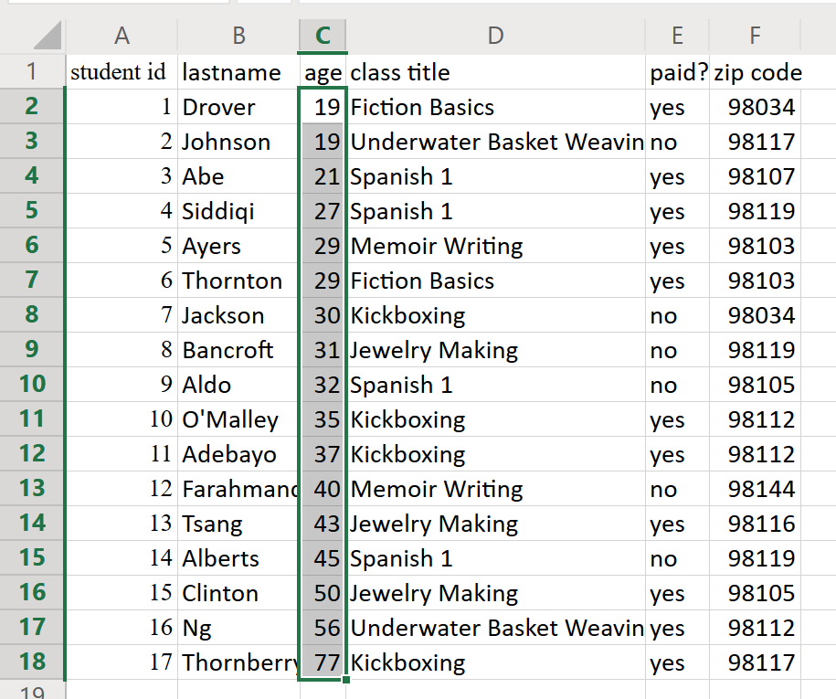

# A Practical Introduction to Data Analysis for Absolute Beginners

## Module 5 - Lab 1: Data Privacy

## Learning Objectives

* Determine which variables in a data set should be classified as personal data.
* Understand various methods to hide or “mask” users’ personal data.
* Practice masking data in Excel.

## Data Set

[Personal data set](Module%205%20Lab%20Data%20Ethics%20-%20personal%20data.xlsx)

You can download this data set and store it so you can use it later on for the exercises.

## What You’ll Need

To complete the lab, you will need the online version of Microsoft Excel.

## Overview

Protecting people’s privacy is an important concern in data analysis. When we think of data values that typically comprise “ personally identifiable information ,” or PII , the easiest ones to recall are probably financial in nature — you wouldn’t want your credit card number broadcast out in the world. But PII actually covers a range of values, such as Social Security numbers, phone numbers, gender identification, race, date of birth, biometrics, address, and immunization records. These are data values you want to keep locked down. Today, personal data can also include many other data types, including your fingerprint, images of your face, social media posts, and more.

In this lab, we’ll look at a small data set and determine which variables (if any) fall under the category of “personal data” and should therefore be protected. After that, we’ll look at a few methods for hiding or “masking” that data.

### Exercise 1: Identifying Personal Data

1. Open the data set in Excel, which shows class registrations at a community center for 17 different students. Here’s what the data look like:

2. Which variable(s) in the data set can be classified as PII, or personally identifiable information?

Answer: PII includes anything that might be used to distinguish one individual from another (or identify a
specific individual).

In this data set, there are three variables that could be considered PII when used in tandem with each other: last name, age, and zip code.

Why? Because if we know a person’s last name, age, and zip code, we could potentially identify that individual and discover other information about them (e.g. online).

On the other hand, the student ID number, class title, and payment fields don’t contain any sensitive information.

### Exercise 2: Masking Personal Data

Now that you’ve identified the last name, age, and zip code fields as sensitive personal data, you need to
figure out how to protect that data. There are many different methods for masking PII. Here are five of such methods:

* **Substitution**: Swapping out a real value for a fake or random value. For example, you might use the fake credit card number 1234-5678-9012-3456 instead of the person’s actual card number. This method is effective, but it carries the risk that the substituted values may actually mean something as well, or that the original reason and function for storing the value gets lost.

* **Shuffling**: Scrambling or reordering the values inside a column of data, thereby removing the association with the rows. For example, you might take name/age value pairs like (Sarah, 31), (Raul, 43), (Ahmed,56) and shuffle the ages around to get (Sarah, 56), (Raul, 31), (Ahmed, 43). The danger is that they are still real values, and could potentially be reassociated.

* **Number/date variance**: Shifting values or dates up, down, forward, or back. For example, you could push dates of birth forward by a month, e.g. from 10-31-1993 to 11-31-1993. The value is then still a date, albeit no longer accurate.

* **Encryption**: Encoding your data using an algorithm or cipher. An example is Pig Latin, where you transfer
the first consonant/sound of each word to the end of the word and add “-ay” (e.g. “chicken soup” becomes "ickenchay oupsay"). When you know the rule (or key), you can decipher the code. Modern encryption uses a variety of algorithms to do this — for example, your bank transfers are encrypted so you can digitally transfer money safely.

* **Deletion**: Simply deleting the value from the record entirely. However, you lose data integrity when you do this.

In the data set from Exercise 1, let’s say that you want to mask each student’s name, age, and zip code information — but you don’t want to outright delete or alter the data itself (e.g. because you want to know the average age of students at this community center, the number of individuals who reside in each zip code, etc.). How would you do that in Excel? Here’s one technique.

1. Start by opening the data set in Excel again.

2. You don’t want to delete/alter the data, and you don’t have the tools to encrypt it. Instead, try
using the shuffling method mentioned above. One simple way to scramble/shuffle these data points in Excel is to reorder the data in the individual columns.

In other words, the problem is that we know Student 1’s last name is Drover, they’re 29 years old, and they live in the 98034 zip code. We want to “unattach” their age and zip code from their name, while still keeping that age and zip code somewhere within the data set.

3. To do this, simply reorder the data in the age and zip code columns. (It’s probably best to keep each last name correlated with the class that person is taking for attendance purposes, so we’ll leave the last name column alone.) First, highlight all the ages.

4. In the Home tab of the ribbon, head over to the Editing pane and click Sort & Filter > Sort
Ascending.

Now you might get a pop-up message asking you if you want to expand your sort. Probably, Excel has noticed the order of the student id. In this case, we want to only sort our selection, so choose "Just sort".

(You could just as easily use Sort Descending for the purposes of randomly masking data like this — it doesn’t really matter.)

Now the age data will be sorted from lowest to highest, which means each age will no longer be associated with the correct person. This is what we want for privacy purposes!

5. Now we’ll do something similar with the zip code data — again, so that each zip code is not associated with the correct student’s last name. Highlight all the zip codes. Head back to the Editing pane in the Home tab. Use Sort Descending this time, because why not?

Choose again for "Just sort" if the pop-up message will appear, as we specifically only want to sort the zip codes, independently from others variables.

The zip codes will now be reordered from highest to lowest, as if they represented numerical values.

The data are all still there, but now we can’t use those data as easily to identify any specific individuals. For example, it now appears that Drover is a 19-year-old who lives at 98144, when we really know from earlier that this person is 29 and lives at 98034. It’s not the most robust way to protect their identity, but it’s definitely better than nothing. You’ve essentially masked
their PII.
